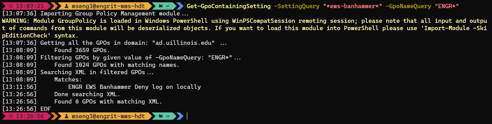

# Summary
Searches matching GPOs in the given domain for those with XML matching a given string.

# Requirements
- Requires Powershell 7+, due to using the `ForEach-Object -Parallel` functionality.

# Usage
1. Download `Get-GpoContainingSetting.psm1` to the appropriate subdirectory of your PowerShell [modules directory](https://github.com/engrit-illinois/how-to-install-a-custom-powershell-module).
2. Run it using the examples and parameter documentation below.

# Examples
Search XML of all GPOs named like `ENGR*` for the string `*ews-banhammer*`:
```powershell
Get-GpoContainingSetting -SettingQuery "*ews-banhammer*" -GpoNameQuery "ENGR*"
```



# Parameters

### -SettingQuery \<string\>
Required string.  
The wildcard query to search for in each GPO's XML.  
Note that specific settings are referred to in a GPO's XML using an internal name, and their friendly name (as shown in ADUC/GPMC) does not appear in the XML. For example the `Deny log on locally` setting is called `SeDenyInteractiveLogonRight` in the XML.  


### -GpoNameQuery \<string\>
Optional string.  
The wildcard query used to filter all retrieved GPOs before searching through their XML.  
Default is `*` (i.e. all GPOs in the domain).  
Note: it's highly recommended to filter GPOs as much as possible to reduce runtime. The search may take on the order of ~20 minutes when filtered down to ~1000 GPOs.  

### -Domain \<string\>
Optional string.  
The domain from which to pull GPOs.  
Default is `ad.uillinois.edu`.  

# Notes
- Script originally by jbabiarz.
- Rewritten by mseng3. See my other projects here: https://github.com/mmseng/code-compendium.
