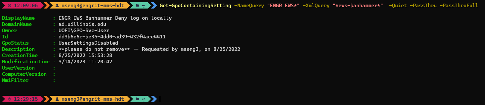

# Summary
Searches GPOs in the given domain and returns those which have names matching a given string, and which contain text in their XML or HTML exports matching a given string.  
Useful to discover which GPOs implement a given setting.  
Despite the name of the module, it will search ALL of the XML/HTML of every name-matched GPO, so you can search for anything that is stored in the GPOs' XML, not just setting names.  
This also means that it will take a while to export and search all the XML/HTML, so you should make sure to confine the search by GPO name as much as possible.  

# Requirements
- Requires Powershell 7+, due to using the `ForEach-Object -Parallel` functionality.

# Usage
1. Download `Get-GpoContainingSetting.psm1` to the appropriate subdirectory of your PowerShell [modules directory](https://github.com/engrit-illinois/how-to-install-a-custom-powershell-module).
2. Run it using the examples and parameter documentation below.

# Examples

### Search for GPOs named like `ENGR*` which implement the "Deny log on locally" setting
```powershell
Get-GpoContainingSetting -NameQuery "ENGR*" -TextQuery "*SeDenyInteractiveLogonRight*"
```


### Silently search for GPOs named like `ENGR EWS*` which contain the string `*ews-banhammer*` in their XML, and return the entire GPO object
```powershell
Get-GpoContainingSetting -NameQuery "ENGR EWS*" -TextQuery "*ews-banhammer*"  -Quiet -PassThru -PassThruFull
```



### Search for GPOs with registry-based settings orphaned by ADMX template updates
Orphaned registry-based settings can be identified because in the HTML version of the export, they show up under a special section named `Extra Registry Settings`.  
For identifying other issues with GPOs, see [Audit-MisconfiguredGpos](https://github.com/engrit-illinois/Audit-MisconfiguredGpos).  
```powershell
Get-GpoContainingSetting -NameQuery "ENGR*" -ReportType "HTML" -TextQuery "*Extra Registry Settings*"
```


# Parameters

### -TextQuery \<string\>
Required string.  
The wildcard query to search for in each GPO's .  
Note 1: The module treats the entire GPO report returned for each GPO as a single large string. This effectively means you must always append `*` to the beginning _and_ end of the `-TextQuery` in order for the module to be useful (unless you're actually trying to determine whether your query matches the entire GPO report string). Of course, you can optionally also have additional `*` in the middle of the `-TextQuery` as necessary.  
Note 2: Specific settings are referred to in a GPO's XML using an internal name. Their friendly name (as shown in ADUC/GPMC) does not appear in the XML. For example the `Deny log on locally` setting is called `SeDenyInteractiveLogonRight` in the XML. If you're unsure what the internal name of a setting is, try using `-ReportType "HTML"` instead, as the friendly names will appear in the HTML report.  


### -NameQuery \<string\>
Optional string.  
The wildcard query used to filter all retrieved GPOs before searching through their XML/HTML.  
Default is `*` (i.e. all GPOs in the domain).  
Note: it's highly recommended to filter GPOs as much as possible to reduce runtime. Expect a search of ~1000 name-matched GPOs to take on the order of ~20 minutes.  

### -ReportType \<"XML" | "HTML"\>
Optional string with value of `XML` or `HTML`.  
Whether to export GPO reports as XML or HTML before searching through them.  
For most circumstances `XML` is recommended, however `HTML` can be useful for identifying which GPOs have orhpaned settings, which do not appear any differently in XML, but _do_ appear differently in the HTML render.  
Default is `XML`.  

### -Domain \<string\>
Optional string.  
The domain from which to pull GPOs and GPO report data, e.g. `ad.uillinois.edu`.  
From the [Get-GPO](https://learn.microsoft.com/en-us/powershell/module/grouppolicy/get-gpo?view=windowsserver2022-ps#parameters) and [Get-GPOReport](https://learn.microsoft.com/en-us/powershell/module/grouppolicy/get-gporeport?view=windowsserver2022-ps) documentation: "If you do not specify the Domain parameter, the domain of the user that is running the current session is used."  

### -Server \<string\>
Optional string.  
The name of the domain controller contacted to pull GPO and GPO-Report data.  
From the [Get-GPO](https://learn.microsoft.com/en-us/powershell/module/grouppolicy/get-gpo?view=windowsserver2022-ps#parameters) and [Get-GPOReport](https://learn.microsoft.com/en-us/powershell/module/grouppolicy/get-gporeport?view=windowsserver2022-ps) documentation: "If you do not specify the name by using the Server parameter, the primary domain controller (PDC) emulator is contacted."  

### -ThrottleLimit \<int\>
Optional integer.  
The number of GPO XML/HTML reports to asynchronously request and process simultaneously.  
Default is `10`.  
Use extreme caution setting this value any higher. It can speed up the results, but going too high can result in the DC failing to respond with GPO report data. In this case the module will throw an error, but will continue processing further GPOs, so you will likely end up missing a lot of data, and thus the results will be incomplete and mostly worthless.  
Using the default value of `10`, expect a search of ~1000 name-matched GPOs to take on the order of ~20 minutes.  

### -Quiet
Optional switch.  
If specified, nothing is logged to the console.  
Should be used with `-PassThru`, or else nothing will be returned at all.  

### -PassThru
Optional switch.  
If specified, the matching GPO names will also be returned as an array of strings.  
This is in addition to the console output (which will also display the GPO names), assuming `-Quiet` is not specified.  

### -PassThruFull
Optional switch.  
If specified, and `-PassThru` is specified, the entire GPO objects for each matching GPO will be returned as an array of PSObjects, instead of as an array of strings representing just the GPO names.  
This switch has no effect if `-PassThru` is not specified.  

### -Verbosity \<int\>
Optional integer.  
Set to 1 or higher to output some additional information during each operation.  

# Notes
- Script concept originally by jbabiarz.
- Rewritten by mseng3. See my other projects here: https://github.com/mmseng/code-compendium.
